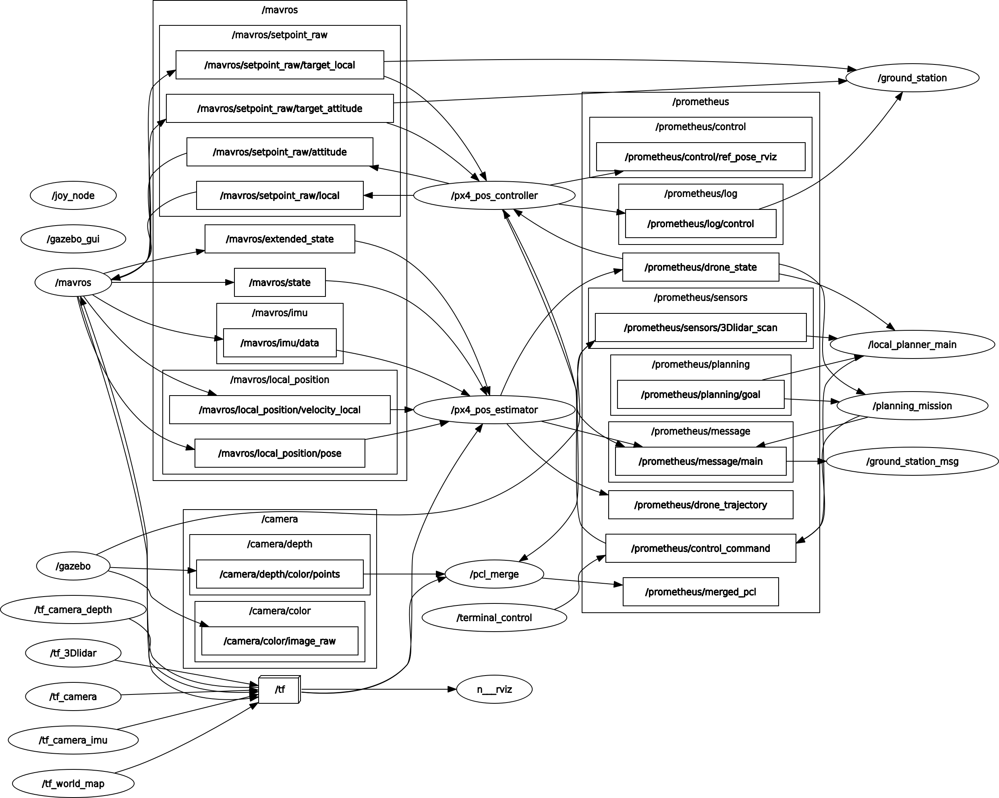

# APF-Planner

The apf_planner package, modified from [local_planner](https://github.com/amov-lab/Prometheus/tree/v1.1/Modules/planning/local_planner)


video on [bilibili](https://www.bilibili.com/video/BV1Lr421u7z9/) 

## Release Note

- v1.2.0: support `XYZ_VEL` control
- v1.1.0: drone facing front while moving

```bash
catkin_make install --source src/APF-Planner --build build/apf_planner
```

```bash
roslaunch apf_planner simulation.launch
```


